## State Machine Blueprint library.

Implementation of a state machine inside blueprint editor. Was searching for the best form of state machine presentation in blueprints and created my own state machine implementation for Unreal Engine 4.

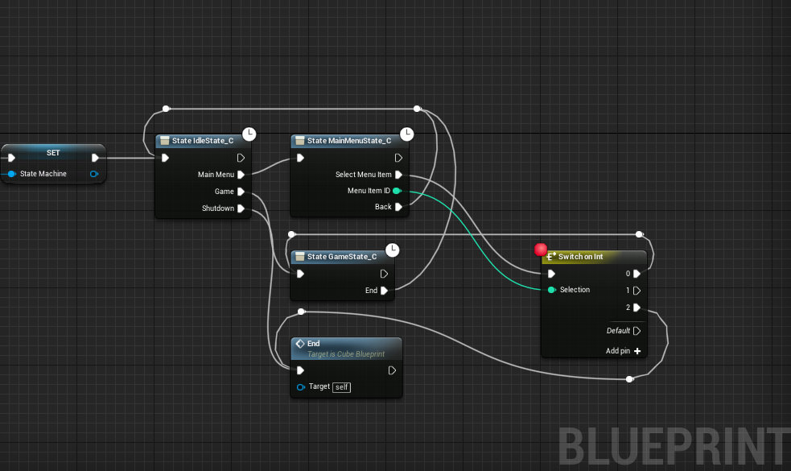

## States

States are implemented by subclassing State class. So every state is represented by a separate blueprint, states can be easely reused in different state machines (if they are not dependent on specific state machine type, by default they are not), any state machine can have as amny instances of any state as you want, but I am not sure it is useful in any case.

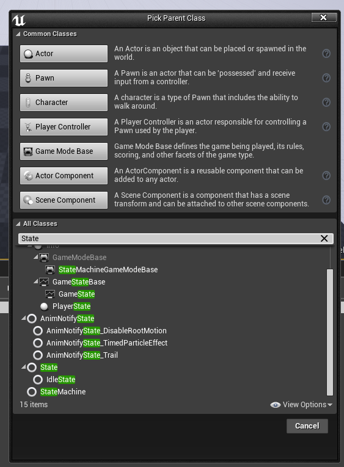

Create requred states by subclassing State class. Every state incapsulate it's logic inside a blueprint class (but also states can be implemented purely in C++). Every state have **Enter**, **Tick** and **Exit** functions. These are executed when state is entered, updated and left.

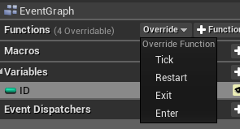

Any state can have variables exposed by setting **Expose on Spawn** flag, their corresponding nodes can be wired to set their values before state is entered.

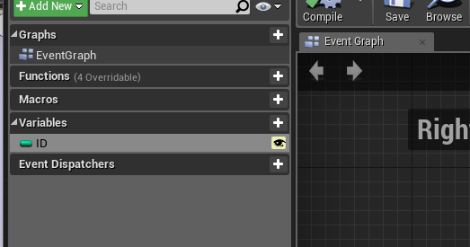

## State transitions

Transitions are represented with blueprint's **Event Dispatchers**.

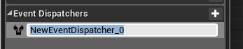

Every event dispatcher is generation execution output node on a state, which can be connected to another state, or to some blueprint logic. Dispatcher events can have their own parameters, which are exposed by state bluperint node.

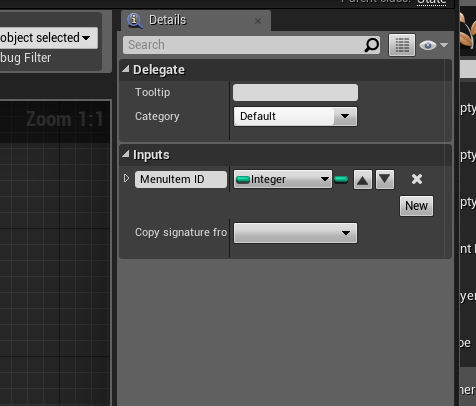

From inside a state you can initiate a transition by simply calling event dispatcher.

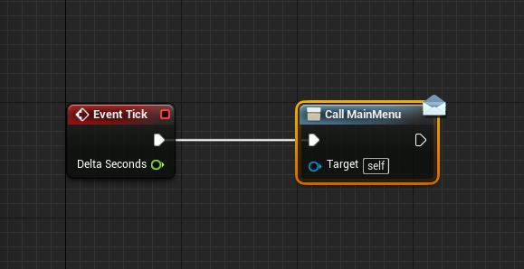

## State Machine

To run all the sates you should have some Sate Machine object. Any blueprint can be converted into sate machine by adding a **StateMachine** variable (naming is important) of type StateMachine.

It should be created and initialized before any use of state machine, or state creation. Better to do this in Event BeginPlay.

To run a StateMachine you should call it's update function whenever you want (but preferably in Tick event)

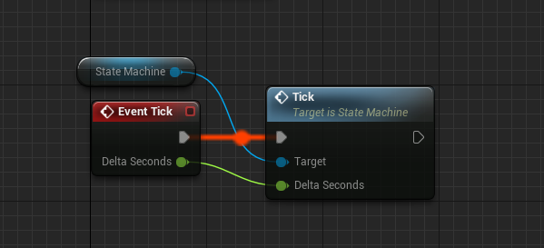

## Definition of a State MAchine

To define a state machine you simply put state nodes on a blueprint canvas.

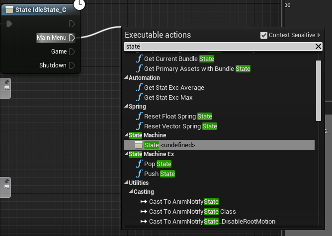

After adding empty state node go to it's details and select it's **State Class**.

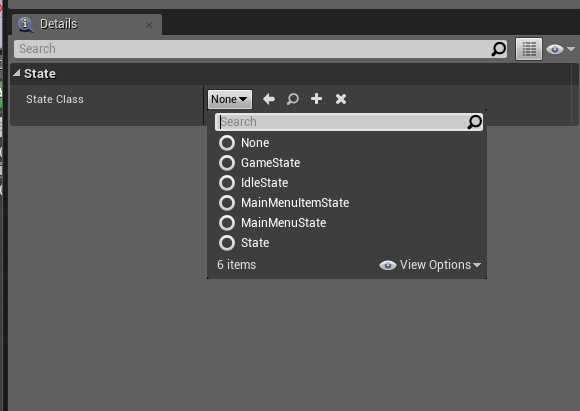

After that connect state outputs to state nodes or bluperint nodes to define state machine transition logic.

## Troubleshooting

If, after editing state events or variables, compilation of a blueprint fails just right click on a state node and click Refersh Node.

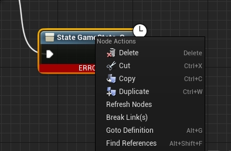